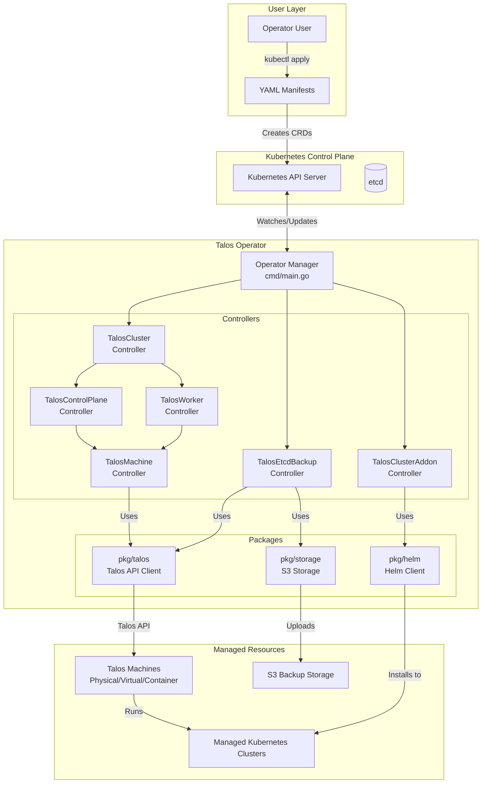
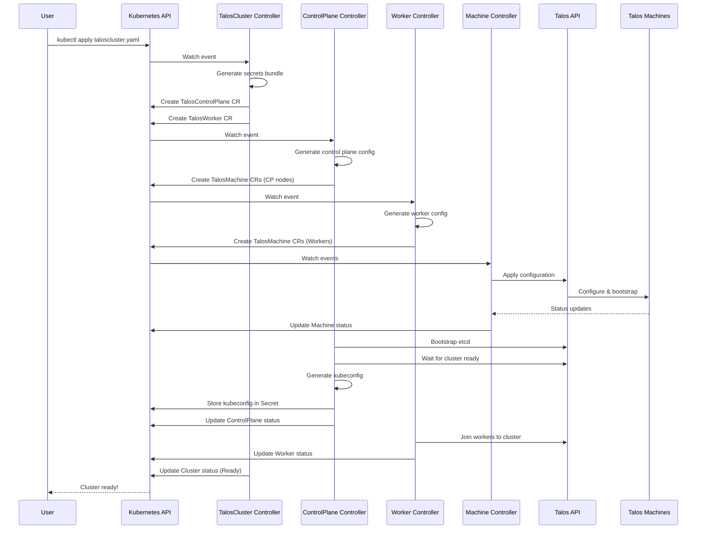
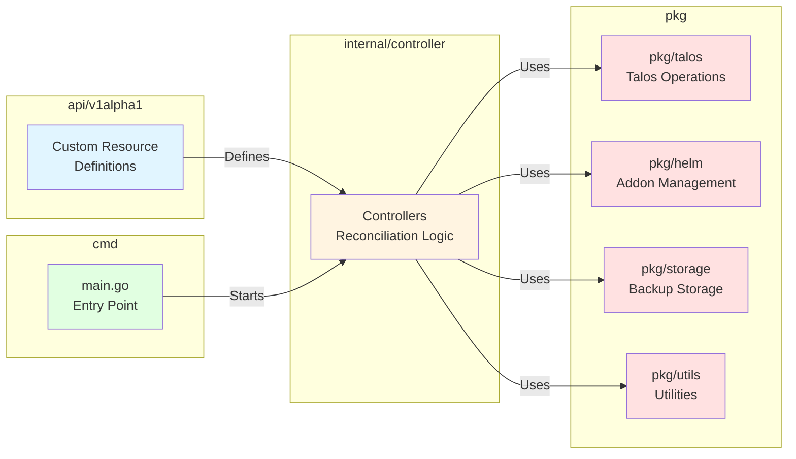
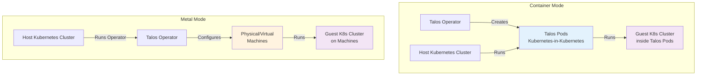
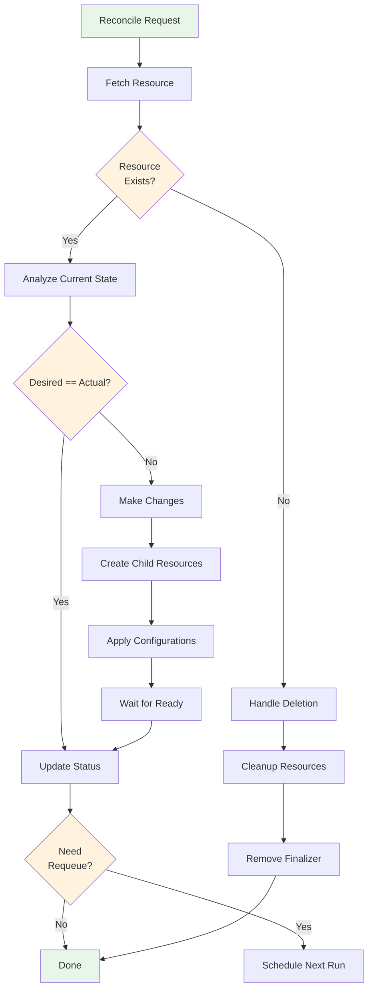
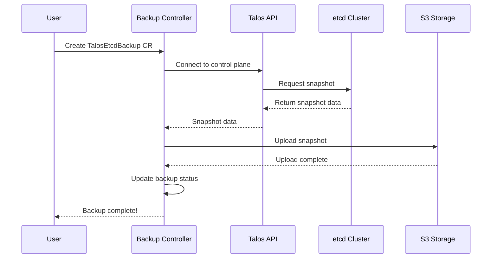
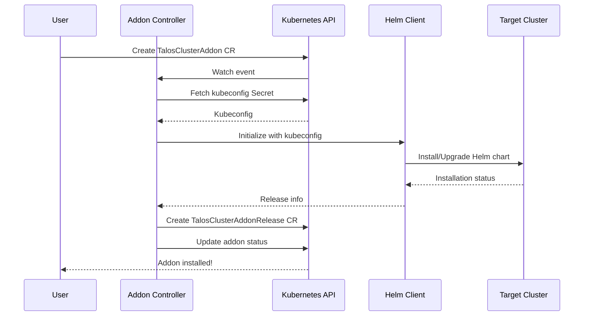
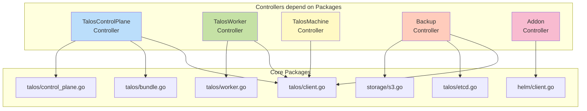

# Architecture Diagrams

This page contains visual diagrams to help understand the talos-operator architecture.

## High-Level Architecture

## Resource Lifecycle Flow

## Module Interaction

## Deployment Modes

## Controller Reconciliation Pattern

## Backup Flow

## Addon Installation Flow

## Package Dependencies

## Key Takeaways

1. **Layered Architecture**: Clear separation between API definitions, business logic (controllers), and utilities (packages)

2. **Controller Pattern**: Each resource type has a dedicated controller that continuously reconciles desired vs actual state

3. **Package Reusability**: Common operations are extracted into packages that multiple controllers can use

4. **Mode Flexibility**: The same operator can manage clusters in different environments (container vs metal mode)

5. **Kubernetes-Native**: Leverages Kubernetes API for state management, watches, and reconciliation

For detailed explanations, see:
- [Quick Reference](quick-reference.md) for quick lookup
- [Module by Module Guide](module-by-module-guide.md) for comprehensive details
