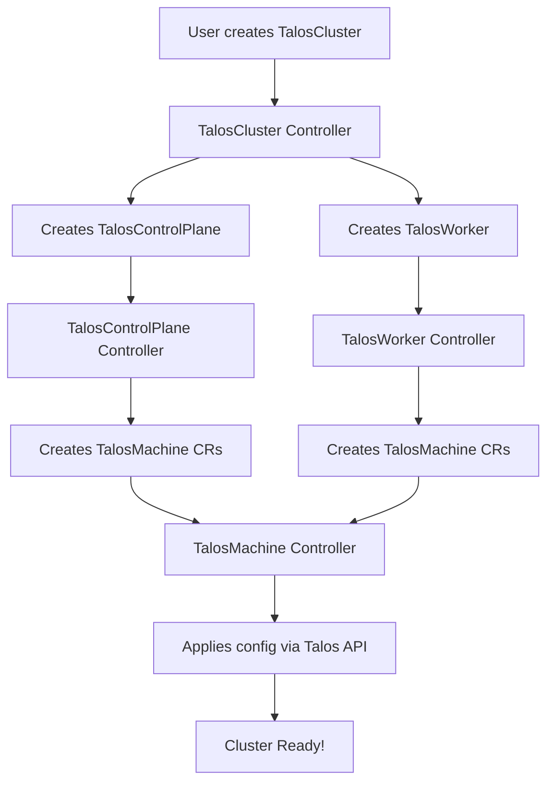

# Talos Operator - Quick Reference

This page provides a quick reference for understanding the talos-operator project structure.

## Project Structure at a Glance

```
talos-operator/
│
├── 📦 api/v1alpha1/              → Custom Resource Definitions (What users define)
│   ├── taloscluster_types.go        Complete cluster resource
│   ├── taloscontrolplane_types.go   Control plane nodes
│   ├── talosworker_types.go         Worker nodes
│   ├── talosmachine_types.go        Individual machines
│   ├── talosclusteraddon_types.go   Cluster addons
│   └── talosetcdbackup_types.go     Backup resources
│
├── 🎮 internal/controller/       → Controllers (How desired state is achieved)
│   ├── taloscluster_controller.go   Orchestrates entire cluster
│   ├── taloscontrolplane_controller.go   Manages control plane
│   ├── talosworker_controller.go    Manages workers
│   ├── talosmachine_controller.go   Manages individual machines
│   └── talosetcdbackup_controller.go    Handles backups
│
├── 🔧 pkg/                       → Reusable Packages (Tools and utilities)
│   ├── talos/                       Talos API client & config generation
│   ├── helm/                        Helm chart operations
│   ├── storage/                     Backup storage (S3, etc.)
│   └── utils/                       Common utilities
│
├── 🚀 cmd/                       → Application Entry Point
│   └── main.go                      Starts the operator
│
├── ⚙️  config/                    → Kubernetes Deployment Manifests
│   ├── crd/                         CRD definitions
│   ├── manager/                     Operator deployment
│   └── rbac/                        Permissions
│
├── 📚 docs/                      → Documentation
├── 💾 deploy/                    → Helm Chart for deployment
├── 📝 examples/                  → Example manifests
└── 🧪 test/                      → Test suites
```

## Core Resources (CRDs) - What You Define

| Resource | Purpose | Key Config |
|----------|---------|------------|
| **TalosCluster** | Complete cluster definition | Control plane + Workers |
| **TalosControlPlane** | Kubernetes control plane | API server, etcd, scheduler |
| **TalosWorker** | Worker nodes | Compute nodes for workloads |
| **TalosMachine** | Individual machine | Low-level machine details |
| **TalosClusterAddon** | Cluster add-ons | CNI, CSI, monitoring |
| **TalosEtcdBackup** | etcd backup | One-time backup |
| **TalosEtcdBackupSchedule** | Scheduled backups | Automated backups |

## Controllers - How It Works



## Key Packages - The Toolbox

### pkg/talos - Talos Operations
- **client.go**: Connect to Talos API
- **bundle.go**: Generate secrets & certificates
- **control_plane.go**: Generate control plane config
- **worker.go**: Generate worker config
- **kubernetes.go**: K8s operations (bootstrap, upgrade)
- **etcd.go**: etcd management
- **write.go**: Apply config to machines

### pkg/storage - Backup Storage
- **s3.go**: S3-compatible backup storage

### pkg/helm - Addon Management
- **client.go**: Install/upgrade Helm charts

### pkg/utils - Utilities
- **utils.go**: Common helper functions

## Deployment Modes

| Mode | Description | Use Case |
|------|-------------|----------|
| **container** | Talos runs in Kubernetes pods | Development, testing, K8s-in-K8s |
| **metal** | Talos runs on physical/virtual machines | Production, bare metal |
| **cloud** | Talos runs on cloud VMs | (Coming soon) Cloud deployments |

## Common Workflows

### 1. Create a Cluster

```yaml
# Simple cluster with inline config
apiVersion: cluster.talos-operator.io/v1alpha1
kind: TalosCluster
metadata:
  name: my-cluster
spec:
  controlPlane:
    mode: container
    replicas: 3
    version: v1.10.3
    kubeVersion: v1.33.1
  worker:
    mode: container
    replicas: 2
```

### 2. Scale Workers

```bash
kubectl patch talosworker my-cluster-worker -p '{"spec":{"replicas":5}}' --type=merge
```

### 3. Upgrade Kubernetes

```bash
kubectl patch taloscontrolplane my-cluster-cp -p '{"spec":{"kubeVersion":"v1.34.0"}}' --type=merge
```

### 4. Backup etcd

```yaml
apiVersion: cluster.talos-operator.io/v1alpha1
kind: TalosEtcdBackup
metadata:
  name: my-backup
spec:
  clusterRef:
    name: my-cluster
  storageType: s3
```

## Data Flow

### Cluster Creation
```
User → TalosCluster CR
  ↓
TalosCluster Controller
  ├→ Generate secrets
  ├→ Create TalosControlPlane CR
  └→ Create TalosWorker CR
      ↓
Controllers reconcile
  ├→ Generate Talos configs (pkg/talos)
  ├→ Create TalosMachine CRs
  └→ Apply configs via Talos API
      ↓
Machines bootstrap → Cluster ready
  ↓
Generate & store kubeconfig
```

### Backup Flow
```
User → TalosEtcdBackup CR
  ↓
Backup Controller
  ├→ Connect to etcd (Talos API)
  ├→ Create snapshot
  ├→ Upload to S3 (pkg/storage)
  └→ Update status
```

## File Organization Logic

### api/ - What
Defines the **schema** of resources. Answers: "What can users create?"

### internal/controller/ - How
Implements the **logic** to make desired state reality. Answers: "How do we make it happen?"

### pkg/ - Tools
Provides **libraries** for common operations. Answers: "What tools do we need?"

### cmd/ - Start
Provides **entry point** to run everything. Answers: "How do we start?"

### config/ & deploy/ - Deploy
Provides **manifests** to deploy the operator. Answers: "How do users install this?"

## Key Design Principles

1. **Declarative**: Define desired state, operator handles the rest
2. **Modular**: Control plane and workers are independent
3. **Flexible**: Supports multiple deployment modes
4. **Kubernetes-native**: Uses standard K8s patterns
5. **No CLI needed**: Everything through CRDs

## Quick Commands

```bash
# Install CRDs
make install

# Run operator locally
make run

# Deploy to cluster
make deploy IMG=your-registry/talos-operator:tag

# Run tests
make test

# Build image
make docker-build IMG=your-registry/talos-operator:tag

# Generate code after API changes
make generate manifests
```

## Important Directories

| Directory | Purpose | When to Look Here |
|-----------|---------|-------------------|
| `api/v1alpha1/` | CRD types | Adding/modifying resources |
| `internal/controller/` | Business logic | Understanding how things work |
| `pkg/talos/` | Talos operations | Talos API interactions |
| `examples/` | Sample manifests | Learning how to use |
| `docs/` | Documentation | Everything else |
| `config/` | K8s manifests | Deployment configuration |
| `test/` | Tests | Testing |

## Resource Relationships

```
TalosCluster
├── owns → TalosControlPlane
│           └── creates → TalosMachine (control plane nodes)
│
└── owns → TalosWorker
            └── creates → TalosMachine (worker nodes)

TalosClusterAddon
└── creates → TalosClusterAddonRelease

TalosEtcdBackupSchedule
└── creates → TalosEtcdBackup (on schedule)
```

## Common Tasks → Files to Check

| Task | Check These Files |
|------|------------------|
| Understand cluster creation | `api/v1alpha1/taloscluster_types.go`<br>`internal/controller/taloscluster_controller.go` |
| Modify control plane logic | `internal/controller/taloscontrolplane_controller.go`<br>`pkg/talos/control_plane.go` |
| Add new CRD field | `api/v1alpha1/*_types.go`<br>Run `make generate manifests` |
| Change Talos config generation | `pkg/talos/control_plane.go` or `pkg/talos/worker.go` |
| Add backup storage type | `pkg/storage/` |
| Understand addon installation | `internal/controller/talosclusteraddon_controller.go`<br>`pkg/helm/client.go` |

## Getting Help

- 📖 Full documentation: [Module by Module Guide](module-by-module-guide.md)
- 💬 GitHub Issues: [Report bugs or ask questions](https://github.com/alperencelik/talos-operator/issues)
- 📚 Talos docs: [Talos Linux Documentation](https://www.talos.dev/latest/)
- 🎯 Examples: Check `examples/` directory for real-world usage

---

For comprehensive details on each module, see the [Module by Module Guide](module-by-module-guide.md).
