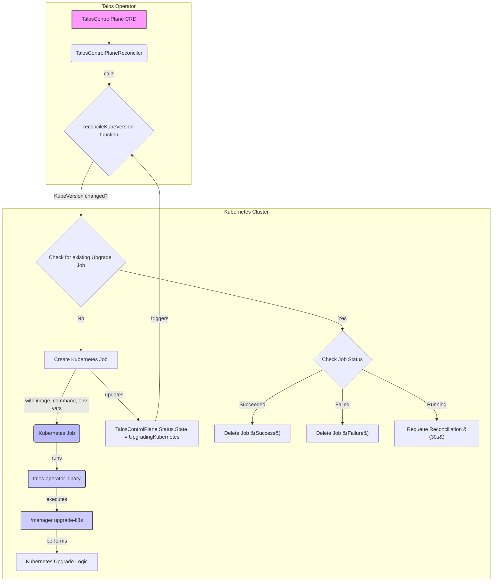

```mermaid
graph TD
    subgraph Talos Operator
        TCP_CRD[TalosControlPlane CRD] --> TCP_RECONCILER(TalosControlPlaneReconciler)
        TCP_RECONCILER -- calls --> RECONCILE_KUBE_VERSION{reconcileKubeVersion function}
    end

    subgraph Kubernetes Cluster
        RECONCILE_KUBE_VERSION -- KubeVersion changed? --> CHECK_JOB{Check for existing Upgrade Job}

        CHECK_JOB -- No --> CREATE_JOB[Create Kubernetes Job]
        CREATE_JOB -- with image, command, env vars --> K8S_JOB(Kubernetes Job)
        CREATE_JOB -- updates --> TCP_STATUS_UPGRADING[TalosControlPlane.Status.State = UpgradingKubernetes]
        TCP_STATUS_UPGRADING -- triggers --> RECONCILE_KUBE_VERSION

        CHECK_JOB -- Yes --> CHECK_JOB_STATUS{Check Job Status}
        CHECK_JOB_STATUS -- Succeeded --> DELETE_JOB_SUCCESS[Delete Job &#40;Success&#41;]
        CHECK_JOB_STATUS -- Failed --> DELETE_JOB_FAIL[Delete Job &#40;Failure&#41;]
        CHECK_JOB_STATUS -- Running --> REQUEUE[Requeue Reconciliation &#40;30s&#41;]

        K8S_JOB -- runs --> TALOS_OPERATOR_BINARY(talos-operator binary)
        TALOS_OPERATOR_BINARY -- executes --> UPGRADE_K8S_CMD["/manager upgrade-k8s"]
        UPGRADE_K8S_CMD -- performs --> K8S_UPGRADE_LOGIC[Kubernetes Upgrade Logic]
    end

    style TCP_CRD fill:#f9f,stroke:#333,stroke-width:2px
    style K8S_JOB fill:#bbf,stroke:#333,stroke-width:2px
    style TALOS_OPERATOR_BINARY fill:#ccf,stroke:#333,stroke-width:2px
    style UPGRADE_K8S_CMD fill:#ccf,stroke:#333,stroke-width:2px
```