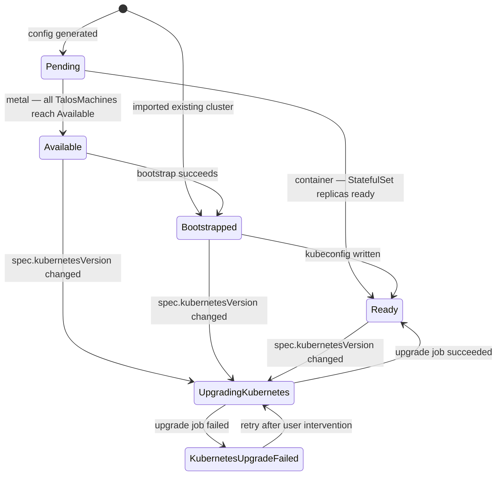
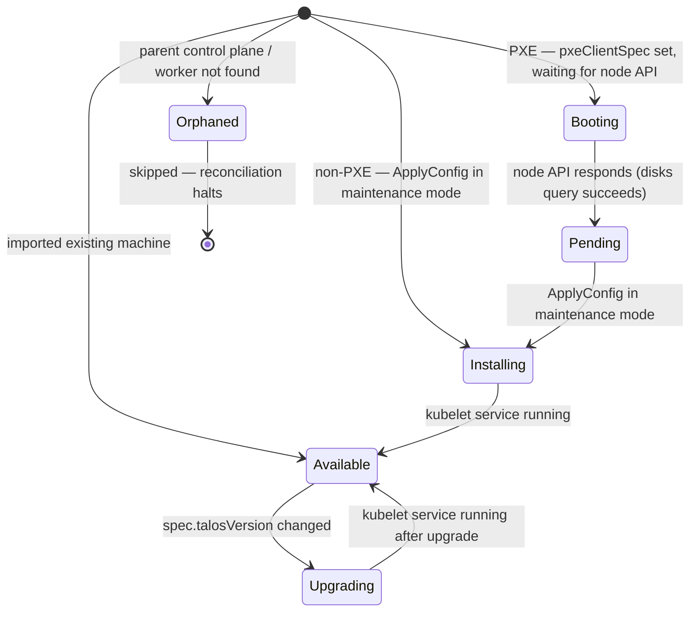
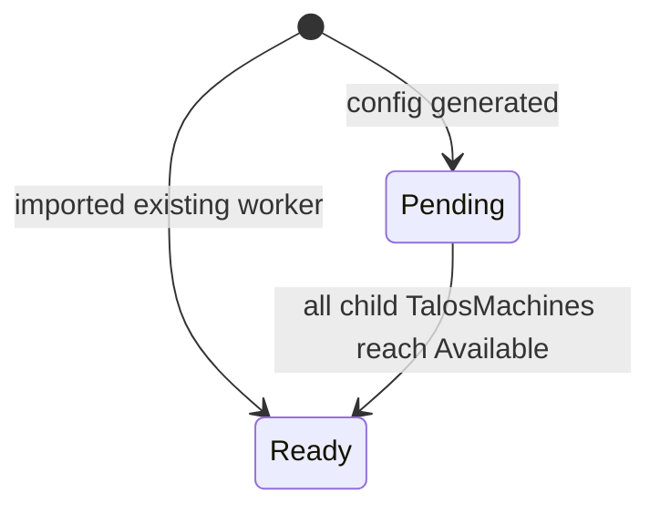

# Reconciliation States

Each top-level CRD exposes a `.status.state` field that the controller drives through a small state machine during reconciliation. The diagrams below reflect the transitions actually implemented in the controllers — not every state constant in `api/v1alpha1/common.go` is reachable for every resource.

The `State` column is also surfaced via `kubectl get` (see each CRD's `printcolumn` markers).

## TalosControlPlane

Normal flow on a metal-mode control plane is `Pending → Available → Bootstrapped → Ready`. Container-mode skips the intermediate states and transitions straight to `Ready` once the backing StatefulSet reports all replicas ready. Kubernetes upgrades run as a side-branch that can re-enter from `Available` or `Bootstrapped`.

!!! note
    `UpgradingKubernetes → Ready` is implicit — the controller does not re-assign the state directly on job success; the next reconcile pass re-evaluates machine readiness and writes `Ready` through the normal path.

## TalosMachine

A machine is `Installing` while its initial Talos config is being applied, then settles into `Available` once the kubelet is running. A spec-level Talos version bump cycles it back through `Upgrading`. `Orphaned` is a terminal state entered when the parent TalosControlPlane or TalosWorker can no longer be resolved.

When `spec.pxeClientSpec` is set the machine starts in `Booting` and the controller polls the Talos disks API every 30 seconds until the node responds; once it does, the machine transitions to `Pending` and the normal install path resumes. Non-PXE machines skip `Booting` and `Pending` entirely — the controller applies the config in maintenance (insecure) mode directly from the initial empty state.

!!! note
    On deletion, `TalosMachine` does **not** transition to a terminal state — the finalizer either issues a Talos `reset` (when the deletion policy requests it) or just removes the finalizer. `Orphaned` machines always skip the reset step.

## TalosWorker

The worker lifecycle is intentionally minimal: it stays `Pending` until every child TalosMachine reaches `Available`, then flips to `Ready`.

## State reference

| State                     | TalosControlPlane | TalosMachine | TalosWorker |
| ------------------------- | :---------------: | :----------: | :---------: |
| `Booting`                 |         —         |    ✓ (PXE)   |      —      |
| `Pending`                 |         ✓         |    ✓ (PXE)   |      ✓      |
| `Installing`              |         —         |       ✓      |      —      |
| `Available`               |         ✓         |       ✓      |      —      |
| `Upgrading`               |         —         |       ✓      |      —      |
| `Bootstrapped`            |         ✓         |       —      |      —      |
| `Ready`                   |         ✓         |       —      |      ✓      |
| `UpgradingKubernetes`     |         ✓         |       —      |      —      |
| `KubernetesUpgradeFailed` |         ✓         |       —      |      —      |
| `Orphaned`                |         —         |       ✓      |      —      |
