# Upgrade Versions

This document provides information on how to upgrade the Talos Operator and its components, including Talos Linux versions and Kubernetes versions. It covers the steps required to ensure a smooth upgrade process and the considerations to keep in mind during the upgrade.

## Upgrading the Talos Version

Talos API does have a unique endpoint for upgrading the Talos version meaning that you have to upgrade via that endpoint rather than updating your config and reapplying the configuration. The Talos Operator keeps the existing TalosVersion (which is referred as observedVersion) and then compare that alongside the desired version at `spec.version` field. If the desired version is different than the observed version, the operator will trigger an upgrade process. 

Once the upgrade is triggered, the TalosMachine controller will send the relevant `Upgrade` command to the Talos Machine. The Talos Machine will then perform the upgrade process and update its status accordingly. The operator will also update the `TalosMachine.Status.Version` field with the new version once the upgrade is completed. 

## Upgrading the Kubernetes Version

Upgrading Kubernetes version is a bit more complex than upgrading Talos version. The Kubernetes upgrade is a long-running job that could take a while to complete. In my tests within <= 3 Node Talos Control Plane, it took around 8-10 minutes to complete the upgrade process. Since that kind of long-running jobs are not suitable for the reconciliation loop, Talos Operator uses a different approach to handle Kubernetes upgrades. 

The trigger mechanism is the same as Talos version upgrade. The operator will compare the desired Kubernetes version at `spec.kubeVersion` field with the observed version and if they are different, it will trigger an upgrade process but instead of sending a command to the Talos Machine, it will create a Kubernetes Job that runs the `talos-operator` binary with the `upgrade-k8s` command. This job will be spawning the operator in a container and runs in specific mode to perform the Kubernetes upgrade logic. After the job performs the update logic, it will update the `TalosControlPlane.Status.State` field to `UpgradingKubernetes` and then it will check the job status. If the job is successful, it will update the observed Kubernetes version to tell upgrade is completed.

The Kubernetes upgrade process is illustrated in the following diagram:

```mermaid
graph TD
    subgraph Talos Operator
        TCP_CRD[TalosControlPlane CRD] --> TCP_RECONCILER(TalosControlPlaneReconciler)
        TCP_RECONCILER -- calls --> RECONCILE_KUBE_VERSION{reconcileKubeVersion function}
    end

    subgraph Kubernetes Cluster
        RECONCILE_KUBE_VERSION -- KubeVersion changed? --> CHECK_JOB{Check for existing Upgrade Job}

        CHECK_JOB -- No --> CREATE_JOB[Create Kubernetes Job]
        CREATE_JOB -- with image, command, env vars --> K8S_JOB(Kubernetes Job)
        CREATE_JOB -- updates --> TCP_STATUS_UPGRADING[TalosControlPlane.Status.State = UpgradingKubernetes]
        TCP_STATUS_UPGRADING -- triggers --> RECONCILE_KUBE_VERSION

        CHECK_JOB -- Yes --> CHECK_JOB_STATUS{Check Job Status}
        CHECK_JOB_STATUS -- Succeeded --> DELETE_JOB_SUCCESS[Delete Job &#40;Success&#41;]
        CHECK_JOB_STATUS -- Failed --> DELETE_JOB_FAIL[Delete Job &#40;Failure&#41;]
        CHECK_JOB_STATUS -- Running --> REQUEUE[Requeue Reconciliation &#40;30s&#41;]

        K8S_JOB -- runs --> TALOS_OPERATOR_BINARY(talos-operator binary)
        TALOS_OPERATOR_BINARY -- executes --> UPGRADE_K8S_CMD["/manager upgrade-k8s"]
        UPGRADE_K8S_CMD -- performs --> K8S_UPGRADE_LOGIC[Kubernetes Upgrade Logic]
    end

    style TCP_CRD fill:#f9f,stroke:#333,stroke-width:2px
    style K8S_JOB fill:#bbf,stroke:#333,stroke-width:2px
    style TALOS_OPERATOR_BINARY fill:#ccf,stroke:#333,stroke-width:2px
    style UPGRADE_K8S_CMD fill:#ccf,stroke:#333,stroke-width:2px
```

